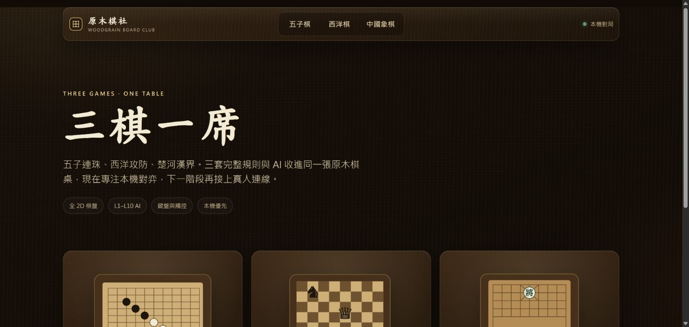
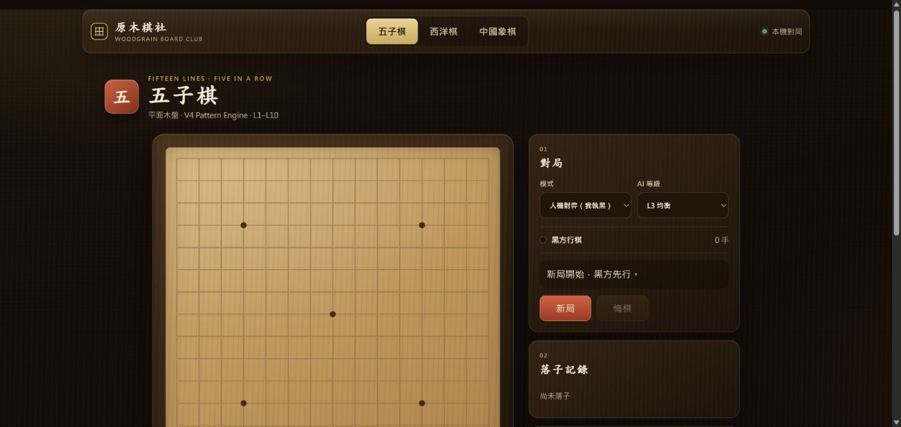
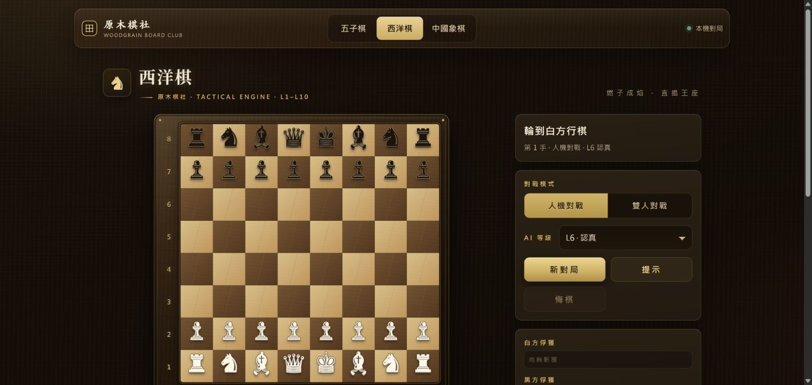
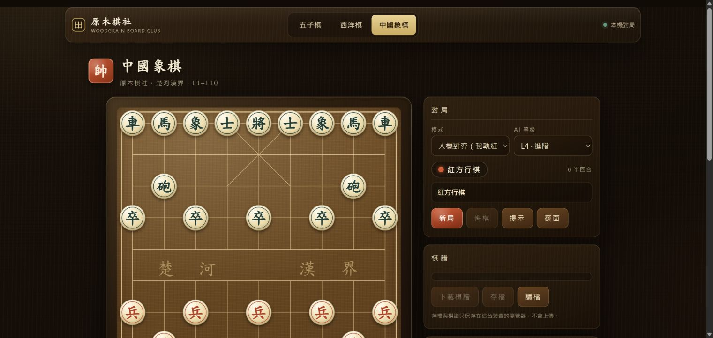

# 原木棋社

給孩子玩的無廣告棋類平台：把五子棋、西洋棋與中國象棋集中在同一張原木棋桌，提供可調整的 L1–L10 AI 與本機對戰。

正式網站：https://wooden-board-game-club.pages.dev/

## 為什麼做這個

市面上的兒童棋類遊戲常被廣告打斷，三種棋又分散在不同 App；AI 難度也往往不是太簡單，就是一下跳得太難。這個作品將三款完整規則與各自的 AI 收進同一個純 2D、無廣告的介面，讓孩子能在熟悉的棋桌上，依自己的程度練習與對弈。

## 畫面預覽

### 首頁



### 五子棋



### 西洋棋



### 中國象棋



## 啟動

```powershell
npm start
```

開啟 `http://127.0.0.1:8787/`。

## 測試

```powershell
npm test
```

測試涵蓋平台 UI contract、三款棋的規則、棋譜與本機引擎接線。

## 建置

```powershell
npm run build
```

`dist/` 只包含瀏覽器必要資產，不含測試、CLI 或設計文件，可直接交給 Cloudflare Pages。

## 本機棋力引擎與授權

五子棋 **L1–L10** 都使用原本的本機 V4 Pattern 演算法。西洋棋與中國象棋的 **L1–L5** 使用原本的快速本機演算法，**L6–L10 與提示** 則使用 Fairy-Stockfish NNUE WebAssembly，分別以 chess / xiangqi UCI 變體分析。三者的局面都不會送到伺服器。

這是依使用者選擇的等級固定分流，不是引擎失敗後的 fallback；引擎失敗會直接回報。所有引擎輸出一律回到各遊戲的規則引擎核對合法著法後才會套用。

因為隨附 GPL-3.0 的引擎物件碼，整個專案以 **GPL-3.0-or-later** 提供；完整條文在 [LICENSE](LICENSE)，上游版本、對應原始碼與來源連結見 [THIRD_PARTY_NOTICES.md](THIRD_PARTY_NOTICES.md)。

## AI 等級校準

L6–L10 的玩家對局遵循瀏覽器實際設定：每級都有固定的 Skill Level 與思考時間；中國象棋的 L7–L10 已改為嚴格遞增的 3.4 / 4.6 / 6.2 / 8.2 秒，西洋棋 L6–L10 為 1.5 / 2.3 / 3.4 / 5.0 / 7.2 秒。

棋力稽核不會把一次短局的勝負當成等級證明。西洋棋與中國象棋各有 12 個可由規則模組重播的深開局，所有對局都使用同開局、交換黑白；稽核模式固定為 Skill 20 加上遞增搜尋深度，並在每局前清空引擎局面與雜湊。統計以同開局的黑白兩局作為一個成對樣本，只檢驗相鄰等級；樣本不足或平手會標示為「證據不足」，不會假裝成已驗證的強弱排序。

五子棋仍完整保留 V4 Pattern 演算法與原有等級設定；其固定節點賽事現在額外記錄各級實際完成搜尋深度、節點與逾時次數，避免把設定上的深度上限誤當成已實際達成的棋力差距。

## 排行榜資料庫

三款遊戲共用獨立 D1 `wooden-board-game-club-leaderboard`，綁定名稱為 `LEADERBOARD_DB`。排行榜只接受玩家擊敗 L6–L10 AI 的完整棋譜；Pages Function 會用各遊戲規則引擎重新播放後才寫入。

```powershell
npx wrangler d1 migrations apply wooden-board-game-club-leaderboard --remote
npx wrangler pages deploy dist --project-name wooden-board-game-club
```

## 架構

- `styles/platform.css`：原木 2D 共用設計 tokens、導覽與響應式規範。
- `shared/game-registry.mjs`：三款遊戲的穩定識別與路由。
- `shared/match-adapter.mjs`：目前使用 `LocalMatchAdapter`；未來遠端 transport 從同一介面接入。
- `shared/leaderboard.mjs`：三款遊戲共用的勝局登記、L6–L10 篩選與排行榜畫面。
- `shared/stockfish-engine-worker.js`：西洋棋／中國象棋共用的本機 Fairy-Stockfish UCI 橋接。
- `games/gomoku/`：全新 DOM/SVG 2D 棋盤與 Rapfi WebAssembly 橋接。
- `games/chess/`：完整西洋棋規則、棋譜與原木平台殼層。
- `games/xiangqi/`：完整中國象棋規則、棋譜與原木平台殼層。

現階段沒有啟用線上配對、房間或 WebSocket，介面會明確顯示「本機對局」；排行榜則透過 Pages Functions 與 D1 提供。
